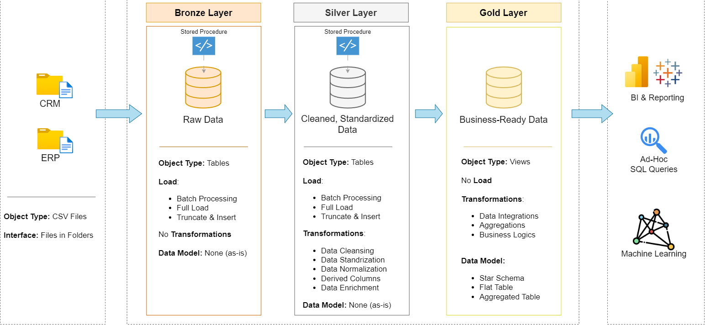
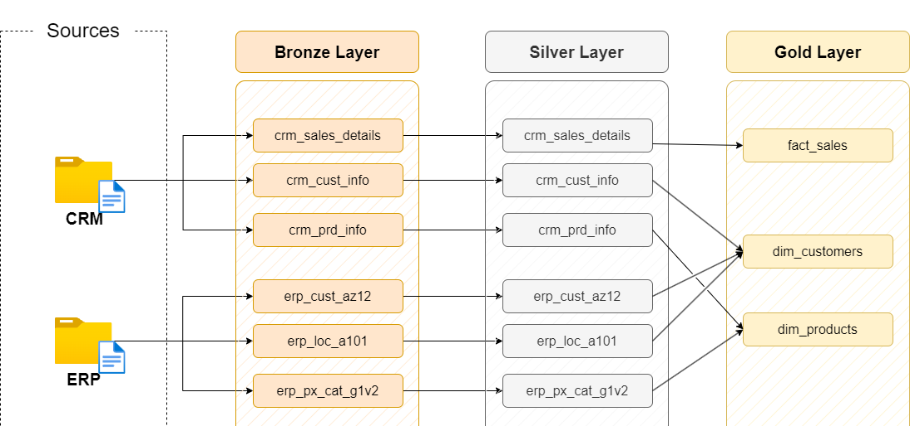

# SQL Data Warehouse & Analytics Project

## 📖 Project Overview

This project demonstrates the design and implementation of a modern data warehouse using a classic Medallion Architecture (Bronze, Silver, Gold). It includes the entire ETL (Extract, Transform, Load) pipeline, from ingesting raw data from different sources to modeling it into a star schema for analytics and reporting.

---

## Architecture

The data warehouse is built using a three-layered Medallion Architecture.



1.  **Bronze Layer**: Ingests raw, unaltered data from source systems. In this project, data is loaded from CSV files into the initial SQL database tables.
2.  **Silver Layer**: The raw data is cleaned, standardized, and conformed. This layer provides a more refined and queryable view of the data.
3.  **Gold Layer**: This layer contains the final, business-ready data, aggregated and modeled into fact and dimension tables (a star schema) optimized for analytical queries and reporting.



---

## 📂 Repository Structure

```
.
├── datasets
│   ├── source_crm
│   │   ├── cust_info.csv
│   │   ├── prd_info.csv
│   │   └── sales_details.csv
│   └── source_erp
│       ├── CUST_AZ12.csv
│       ├── LOC_A101.csv
│       └── PX_CAT_G1V2.csv
├── docs
│   ├── data_architecture.png
│   └── data_flow.png
├── scripts
│   ├── init_database.sql
│   ├── bronze
│   │   ├── ddl_bronze.sql
│   │   └── proc_load_bronze.sql
│   ├── silver
│   │   ├── ddl_silver.sql
│   │   └── proc_load_silver.sql
│   └── gold
│       └── ddl_gold.sql
├── tests
│   └── quality_checks_gold.sql
└── README.md
```

---

## 🚀 How to Use

Follow these steps to set up the database and run the ETL pipeline.

### 1. Initialize the Database

First, create the necessary databases and schemas by running the initialization script.

```sql
-- Execute the contents of this file in your SQL Server instance
-- scripts/init_database.sql
```

### 2. Load the Bronze Layer

Create the bronze tables and then load the raw data from the CSV files.

```sql
-- 1. Create bronze tables
-- Execute: scripts/bronze/ddl_bronze.sql

-- 2. Run the stored procedure to load data
-- (Ensure the file paths in the procedure are correct for your environment)
-- Execute: scripts/bronze/proc_load_bronze.sql
```

### 3. Transform to the Silver Layer

Create the silver tables and run the procedure to clean and transform the bronze data.

```sql
-- 1. Create silver tables
-- Execute: scripts/silver/ddl_silver.sql

-- 2. Run the stored procedure to transform and load data
-- Execute: scripts/silver/proc_load_silver.sql
```

### 4. Build the Gold Layer

Create the final star schema (fact and dimension tables) in the gold layer.

```sql
-- Create the gold layer tables
-- Execute: scripts/gold/ddl_gold.sql
```

---

## ✅ Data Quality Checks

After the pipeline has been executed, you can run data quality checks on the final gold tables to ensure data integrity and accuracy.

```sql
-- Execute the queries in this file to perform quality checks
-- tests/quality_checks_gold.sql
```

---

## 📝 Data Sources

This project uses two main data sources, simulating common business systems:

*   **CRM Data (`source_crm`)**: Contains customer, product, and sales information.
*   **ERP Data (`source_erp`)**: Contains supplementary customer, location, and category data.

---

## 🛡️ License

This project is licensed under the MIT License. You are free to use, modify, and share this project with proper attribution.